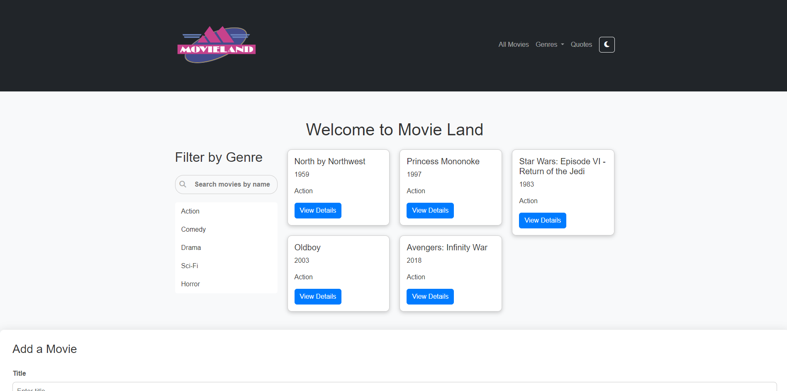
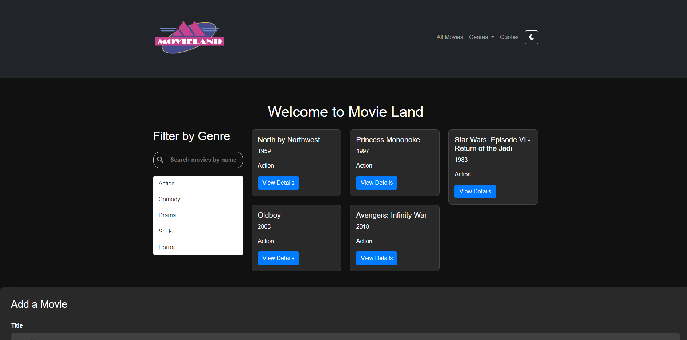

# Movie Land

Welcome to Movie Land, a web application where users can explore and discover information about various movies across different genres.

## Description

Movie Land allows users to:
- Browse a curated collection of movies categorized by genre.
- View details of each movie, including title, year, genre, and description.
- Add new movies to the collection.
- Search for movies by name.
- Toggle between light and dark mode for different viewing preferences.

## Demo

[Check out the live demo of Movie Land!](https://ivot7.github.io/Movie-Land/)

## Screenshots

## Technologies Used

- HTML
- CSS (Bootstrap)
- JavaScript (jQuery)
- External API for fetching random quotes

## How to Use

1. Clone this repository to your local machine.
2. Open `index.html` in your web browser.
3. Explore the collection of movies, search for specific titles, and toggle dark mode as desired.
4. To add a new movie, fill out the form in the "Add Movie" section and submit the form.

## Credits

- Movie data sourced from various sources.
- Quotes fetched from [Forismatic API](https://forismatic.com/en/api/).
